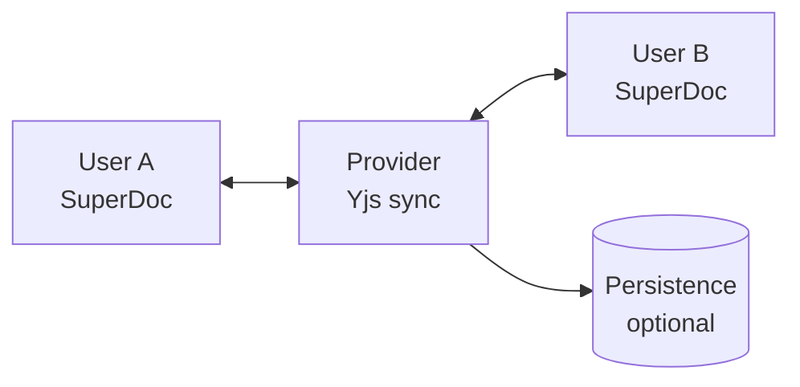

Enable multiple users to edit the same document simultaneously with real-time collaboration powered by [Yjs](https://docs.yjs.dev/).

<iframe
  src={`https://superdoc-collab-example.pages.dev/doc/example?hide-toolbar=true`}
  title="Embedded content"
  className="w-full h-96 rounded-xl border border-gray-200"
  style={{ zoom: 0.7, height: "510px" }}
/>

<CardGroup cols={2}>
  <Card title="Real-time Sync" icon="refresh-cw">
    Changes appear instantly for all connected users
  </Card>
  <Card title="Conflict Resolution" icon="git-merge">
    CRDTs automatically merge concurrent edits
  </Card>
  <Card title="Offline Support" icon="wifi-off">
    Continue editing offline, sync when reconnected
  </Card>
  <Card title="User Awareness" icon="users">
    See who's online with cursors and selections
  </Card>
</CardGroup>

## Choose Your Approach

<Tabs>
  <Tab title="Cloud Providers">
    No server to manage - get started in 5 minutes.

    | Provider | Best For | Pricing |
    |----------|----------|---------|
    | [Liveblocks](/modules/collaboration/cloud/liveblocks) | Quick start, any framework | Free tier available |
    | [TipTap Cloud](/modules/collaboration/cloud/tiptap-cloud) | TipTap Pro users | Requires subscription |

  </Tab>

  <Tab title="Self-Hosted">
    Full control over your data and infrastructure.

    | Option | Best For |
    |--------|----------|
    | [SuperDoc Yjs](/modules/collaboration/self-hosted/superdoc-yjs) | Recommended - our official package |
    | [Hocuspocus](/modules/collaboration/self-hosted/hocuspocus) | TipTap ecosystem users |
    | [Y-Sweet](/modules/collaboration/self-hosted/y-sweet) | High performance, easy deployment |

  </Tab>
</Tabs>

## Quick Start

Get collaboration working in 5 minutes with Liveblocks:

```bash
npm install @liveblocks/client @liveblocks/yjs yjs
```

```javascript
import { createClient } from "@liveblocks/client";
import { LiveblocksYjsProvider } from "@liveblocks/yjs";
import * as Y from "yjs";
import { SuperDoc } from "superdoc";

// 1. Create Liveblocks client
const client = createClient({ publicApiKey: "pk_..." });

// 2. Enter a room and create Yjs provider
const { room } = client.enterRoom("my-document");
const ydoc = new Y.Doc();
const provider = new LiveblocksYjsProvider(room, ydoc);

// 3. Wait for sync, then create SuperDoc
provider.on("sync", (synced) => {
  if (!synced) return;

  new SuperDoc({
    selector: "#editor",
    user: { name: "John", email: "john@example.com" },
    modules: {
      collaboration: { ydoc, provider },
    },
  });
});
```

<Card
  title="Full Quickstart Guide"
  icon="rocket"
  href="/modules/collaboration/quickstart"
>
  Step-by-step setup with complete working example
</Card>

## How It Works

SuperDoc uses [Yjs](https://docs.yjs.dev/), a CRDT (Conflict-free Replicated Data Type) library, to enable real-time collaboration. This means:

1. **No central server required** for conflict resolution
2. **Changes merge automatically** - no data loss
3. **Works with any Yjs provider** - cloud or self-hosted



## Next Steps

<CardGroup cols={2}>
  <Card
    title="5-Minute Quickstart"
    icon="rocket"
    href="/modules/collaboration/quickstart"
  >
    Get collaboration working fast with Liveblocks
  </Card>

{" "}
<Card
  title="Liveblocks Guide"
  icon="cloud"
  href="/modules/collaboration/cloud/liveblocks"
>
  Cloud-hosted collaboration with free tier
</Card>

{" "}
<Card
  title="Self-Hosted"
  icon="server"
  href="/modules/collaboration/self-hosted/overview"
>
  Full control with your own infrastructure
</Card>

  <Card
    title="Client Configuration"
    icon="settings"
    href="/modules/collaboration/configuration"
  >
    All configuration options and events
  </Card>
</CardGroup>
