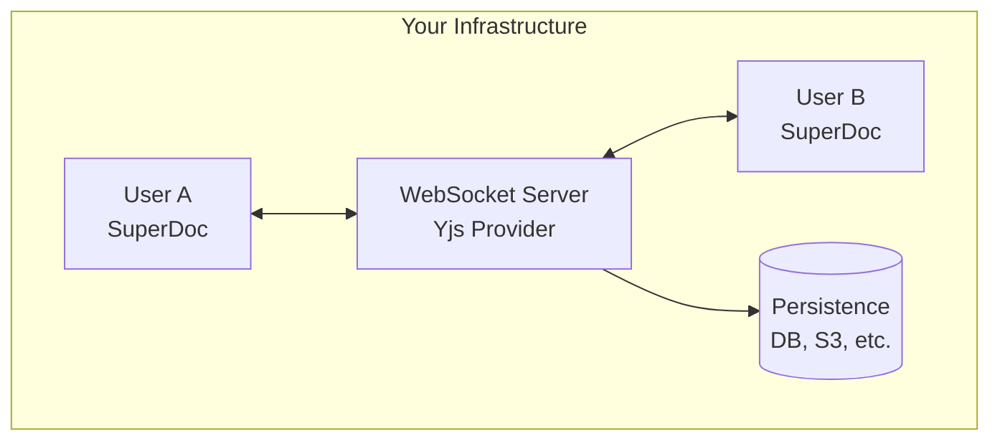

Run your own collaboration infrastructure for full control over data, persistence, and scaling.

## Why Self-Host?

<CardGroup cols={2}>
  <Card title="Data Control" icon="lock">
    Keep all data on your infrastructure
  </Card>
  <Card title="Custom Persistence" icon="database">
    Use your own database (PostgreSQL, S3, Redis)
  </Card>
  <Card title="On-Premise" icon="building">
    Deploy behind your firewall
  </Card>
  <Card title="No Vendor Lock-in" icon="unlock">
    Standard Yjs protocol, portable data
  </Card>
</CardGroup>

## Architecture



## Choose Your Approach

| Option | Best For | Setup Time |
|--------|----------|------------|
| [SuperDoc Yjs](/modules/collaboration/self-hosted/superdoc-yjs) | New projects, recommended | 30 mins |
| [Hocuspocus](/modules/collaboration/self-hosted/hocuspocus) | TipTap ecosystem users | 30 mins |
| [Y-Sweet](/modules/collaboration/self-hosted/y-sweet) | High performance, easy deployment | 30 mins |

## Quick Comparison

<Tabs>
  <Tab title="SuperDoc Yjs">
    **Our official collaboration package**

    - Purpose-built for SuperDoc
    - Builder pattern API
    - Auto-save with debounce
    - Memory management

    ```bash
    npm install @superdoc-dev/superdoc-yjs-collaboration
    ```

    [Get Started](/modules/collaboration/self-hosted/superdoc-yjs)
  </Tab>

  <Tab title="Hocuspocus">
    **TipTap's Yjs server**

    - Mature, battle-tested
    - Rich extension ecosystem
    - Good if already using TipTap

    ```bash
    npm install @hocuspocus/server
    ```

    [Get Started](/modules/collaboration/self-hosted/hocuspocus)
  </Tab>

  <Tab title="Y-Sweet">
    **Jamsocket's Yjs server**

    - High performance, Rust-based
    - Easy to deploy with `npx`
    - Optional managed cloud via Jamsocket

    ```bash
    npx y-sweet@latest serve
    ```

    [Get Started](/modules/collaboration/self-hosted/y-sweet)
  </Tab>

  </Tabs>

## Client Connection Options

When self-hosting, you have two ways to connect SuperDoc:

### Option 1: URL-based (SuperDoc manages provider)

SuperDoc creates and manages the WebSocket connection:

```javascript
new SuperDoc({
  selector: '#editor',
  modules: {
    collaboration: {
      url: 'wss://your-server.com/doc',
      token: 'auth-token'
    }
  }
});
```

### Option 2: Provider-agnostic (You manage provider)

You create the Yjs provider yourself:

```javascript
import { HocuspocusProvider } from '@hocuspocus/provider';
import * as Y from 'yjs';

const ydoc = new Y.Doc();
const provider = new HocuspocusProvider({
  url: 'wss://your-server.com',
  name: 'document-123',
  document: ydoc
});

new SuperDoc({
  selector: '#editor',
  modules: {
    collaboration: { ydoc, provider }
  }
});
```

<Note>
The provider-agnostic approach gives you more control but requires managing the provider lifecycle yourself.
</Note>

## Requirements

### Server

- Node.js 18+
- WebSocket support (native or via library)
- Persistent storage for documents

### Network

- WSS (WebSocket Secure) in production
- Proper CORS configuration
- Load balancer with sticky sessions (if scaling)

## Next Steps

<CardGroup cols={2}>
  <Card
    title="SuperDoc Yjs"
    icon="rocket"
    href="/modules/collaboration/self-hosted/superdoc-yjs"
  >
    Recommended - our official package
  </Card>

  <Card
    title="Hocuspocus"
    icon="server"
    href="/modules/collaboration/self-hosted/hocuspocus"
  >
    Alternative using TipTap's server
  </Card>

  <Card
    title="Y-Sweet"
    icon="bolt"
    href="/modules/collaboration/self-hosted/y-sweet"
  >
    High performance Rust-based server
  </Card>

  <Card
    title="Configuration"
    icon="settings"
    href="/modules/collaboration/configuration"
  >
    All client-side options and events
  </Card>
</CardGroup>
